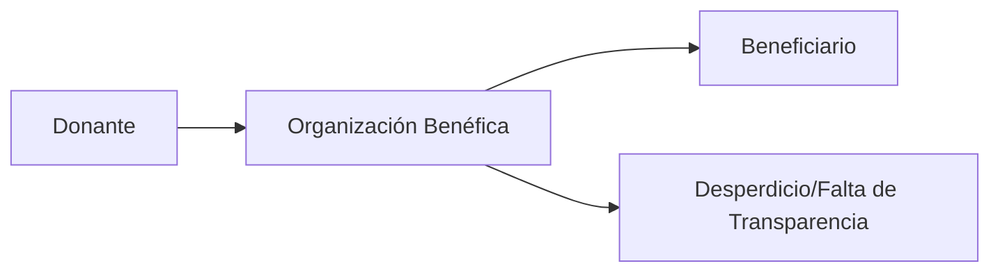

# El problema y la solucion

\
El acceso a la educación de calidad es fundamental para el desarrollo individual y social, pero millones de estudiantes con alto potencial en todo el mundo se ven limitados por la falta de recursos económicos. Las organizaciones benéficas tradicionales, aunque bien intencionadas, a menudo carecen de la transparencia y la eficiencia necesarias para garantizar que las donaciones lleguen a quienes más las necesitan. FutureHands ofrece una solución innovadora a este problema mediante el uso de la tecnología blockchain. Nuestra plataforma permite a los donantes realizar donaciones de forma segura y transparente, siguiendo el recorrido de sus contribuciones desde el origen hasta el beneficiario final. Eliminamos intermediarios y reducimos costos, maximizando el impacto de cada donación.

