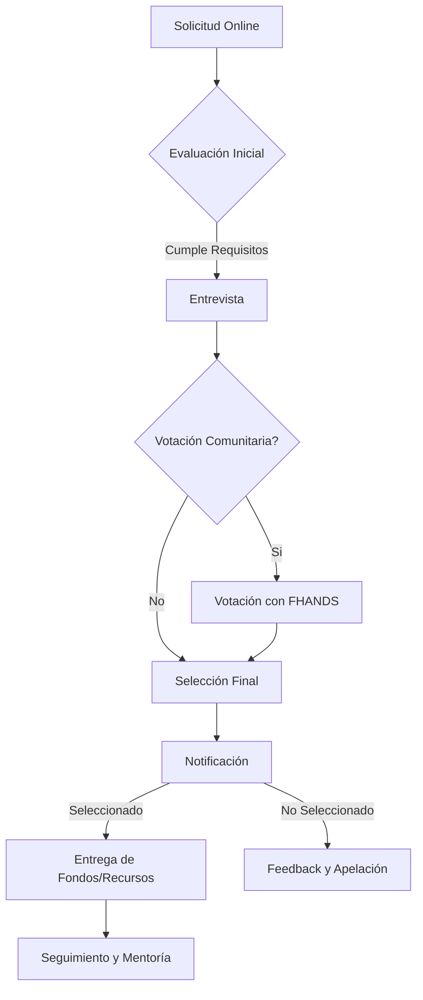

# Proceso de Selección de Beneficiarios

FutureHands se compromete a asegurar que las donaciones lleguen a los estudiantes más merecedores y que el proceso de selección sea transparente, equitativo y basado en el mérito. Esta sección describe el proceso de selección de beneficiarios y las medidas que se toman para garantizar su integridad.

El proceso de selección se divide en las siguientes etapas:

1. **Solicitud:** Los estudiantes interesados completan un formulario online en la plataforma FutureHands, proporcionando información personal, académica, financiera y una carta de motivación. También deben adjuntar comprobantes de ingresos (si corresponde) y expedientes académicos.
2. **Evaluación Inicial:** El equipo de FutureHands revisa las solicitudes para verificar que cumplan con los criterios de elegibilidad básicos, que incluyen:
   * Residir en una comunidad con bajos recursos.
   * Demostrar interés y aptitudes para el desarrollo de software.
   * Cumplir con los requisitos académicos mínimos.
3. **Entrevista:** Los candidatos que superen la evaluación inicial serán entrevistados por el equipo de FutureHands y/o mentores de la comunidad. Las entrevistas se centran en evaluar la motivación, el potencial y la adecuación del candidato al programa.
4. **Votación Comunitaria (Opcional):** En algunos programas de becas, se puede implementar una votación comunitaria utilizando tokens FHANDS. Esto permite a la comunidad de FutureHands participar en la selección de los beneficiarios, priorizando a los candidatos con mayor apoyo.
5. **Selección Final:** El equipo de FutureHands, considerando los resultados de las entrevistas y la votación comunitaria (si corresponde), toma la decisión final sobre la selección de los beneficiarios.
6. **Notificación:** Todos los solicitantes recibirán una notificación por correo electrónico informándoles de la decisión. Se proporcionará feedback personalizado a los no seleccionados para ayudarles a mejorar sus futuras solicitudes.
7. **Entrega de Fondos/Recursos:** Los beneficiarios seleccionados recibirán los fondos de la beca o los recursos educativos correspondientes a través de la plataforma FutureHands.
8. **Seguimiento y Mentoría:** FutureHands realizará un seguimiento del progreso de los beneficiarios y les proporcionará apoyo y mentoría a lo largo del programa. Esto incluye acceso a una red de mentores, talleres, recursos educativos y oportunidades de networking.

**Transparencia e Imparcialidad:**

FutureHands se compromete a garantizar la transparencia y la imparcialidad en todo el proceso de selección. Los criterios de evaluación son claros y objetivos, y la participación de la comunidad a través de la votación con tokens FHANDS añade una capa adicional de democratización al proceso. Además, el registro de las decisiones en la blockchain proporciona una trazabilidad completa y auditable.
