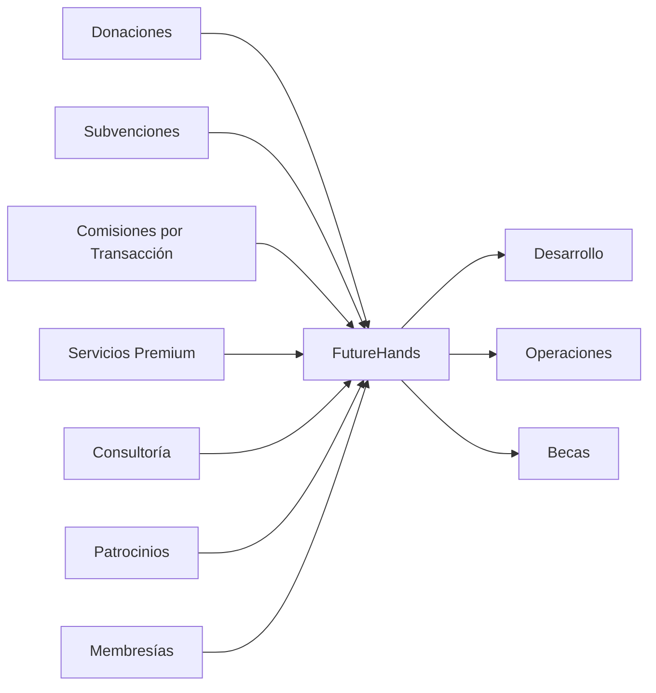

# Modelo de Sostenibilidad

FutureHands se compromete a construir un modelo de financiación sostenible que garantice el impacto a largo plazo del proyecto. Nuestro objetivo es crear un ecosistema autosuficiente que pueda crecer y evolucionar para satisfacer las necesidades de la comunidad.

En la fase inicial, la fundación se financiará principalmente a través de donaciones, subvenciones y la participación en rondas de financiación pre-seed. A medida que la plataforma crezca y gane tracción, se implementarán diversas estrategias para diversificar las fuentes de ingresos y asegurar la sostenibilidad a largo plazo.

**Estrategias de Financiación:**

* **Comisiones por transacción:** Se aplicará una pequeña comisión por cada donación procesada a través de la plataforma. Esta comisión será transparente y se utilizará para cubrir los costos operativos, el desarrollo de la plataforma y el apoyo a los beneficiarios.
* **Servicios premium:** Se ofrecerán servicios premium a empresas y fundaciones, como informes de impacto personalizados, acceso a eventos exclusivos y oportunidades de colaboración con los estudiantes.
* **Venta de servicios de consultoría:** El equipo de FutureHands, con su experiencia en blockchain y desarrollo de software, ofrecerá servicios de consultoría a otras organizaciones que deseen implementar soluciones similares.
* **Colaboraciones y patrocinios:** Se buscarán colaboraciones estratégicas con empresas e instituciones que compartan la visión de FutureHands y deseen apoyar la educación en tecnología.
* **Programas de membresía:** Se ofrecerán programas de membresía con beneficios exclusivos para los donantes recurrentes, como acceso anticipado a nuevas funcionalidades y participación en eventos especiales.

**Gestión de Fondos:**

La Fundación FutureHands se compromete a gestionar los fondos de forma responsable y transparente. Todas las transacciones y el uso de los fondos se registrarán en la blockchain para garantizar la máxima transparencia. Se utilizarán carteras multifirma y se seguirán las mejores prácticas de la industria para la custodia segura de las criptomonedas y stablecoins. Se publicarán informes financieros regulares para informar a la comunidad sobre el estado financiero del proyecto.
