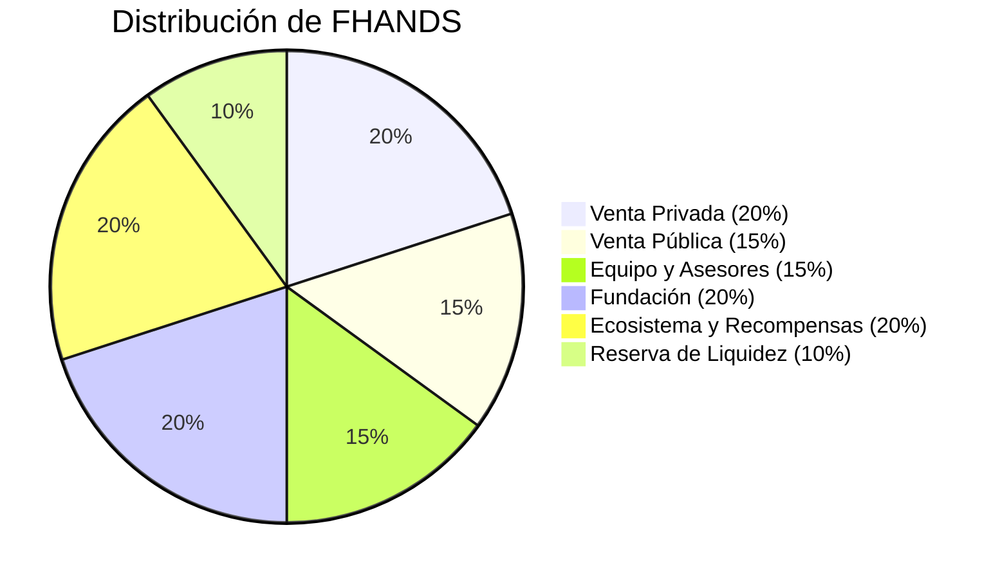

# Tokenomics de FHANDS

El token FHANDS es el token de utilidad y gobernanza del ecosistema FutureHands. Su diseño se centra en incentivar la participación activa de la comunidad, recompensar a los contribuyentes y asegurar la sostenibilidad a largo plazo del proyecto.\

### **Mecanismo de Distribución:**&#x20;

**Suministro Inicial Total:** 100,000,000 FHANDS

La distribución de FHANDS está diseñada para fomentar un ecosistema equilibrado y sostenible:

* **Venta Privada (20%):** 20,000,000 FHANDS. Destinada a inversores estratégicos que aportan capital y experiencia para el desarrollo inicial de la plataforma. Sujeto a un periodo de vesting para alinear los incentivos con el éxito a largo plazo del proyecto.
* **Venta Pública (15%):** 15,000,000 FHANDS. Ofrecida al público en general a través de una venta pública (ej., IDO - Initial DEX Offering), permitiendo la participación de la comunidad y la descentralización de la propiedad del token.
* **Equipo y Asesores (15%):** 15,000,000 FHANDS. Reservados para el equipo fundador y los asesores, recompensando su contribución y compromiso con el proyecto. Sujeto a un periodo de vesting para incentivar la permanencia y la dedicación.
* **Fundación (20%):** 20,000,000 FHANDS. Asignados a la Fundación FutureHands para financiar el desarrollo continuo de la plataforma, las operaciones, el marketing y el crecimiento del ecosistema.
* **Ecosistema y Recompensas (20%):** 20,000,000 FHANDS. Destinados a recompensar a los usuarios activos, incluyendo donantes, mentores, estudiantes y participantes en la gobernanza. Incentiva la participación y fortalece la comunidad.
* **Reserva de Liquidez (10%):** 10,000,000 FHANDS. Asignados a proporcionar liquidez en exchanges descentralizados (DEXs), facilitando el trading del token y reduciendo la volatilidad.

### **Utilidad del Token:**

* **Gobernanza:** Los poseedores de FHANDS pueden votar en propuestas que afectan el desarrollo y la dirección de la plataforma FutureHands. Esto incluye la selección de proyectos a financiar, la asignación de recursos y la implementación de nuevas funcionalidades.
* **Acceso a Servicios Premium:** FHANDS otorga acceso a servicios exclusivos dentro de la plataforma, como análisis avanzados de impacto, informes personalizados y acceso prioritario al equipo de soporte.
* **Recompensas:** Los usuarios activos en la plataforma, como donantes, mentores y participantes en la comunidad, reciben recompensas en FHANDS. Esto incentiva la participación y el crecimiento del ecosistema.
* **Descuentos en comisiones:** Los poseedores de FHANDS pueden obtener descuentos en las comisiones por transacción en la plataforma.

### **Integración con Monedas Estables:**

FutureHands integrará monedas estables como USDC, USDT o DAI para las donaciones y pagos a estudiantes, brindando estabilidad financiera y protegiendo a los usuarios de la volatilidad del mercado de criptomonedas. Los usuarios podrán intercambiar FHANDS por monedas estables dentro de la plataforma, ofreciendo flexibilidad y adaptándose a las preferencias individuales.

Esta combinación estratégica de un token de utilidad y una moneda estable busca ofrecer un ecosistema equilibrado y atractivo, fomentando la participación de donantes y estudiantes, al mismo tiempo que se garantiza la transparencia, la seguridad y la eficiencia en la gestión de fondos gracias a la tecnología blockchain.

### **Mecanismo de Quema de Tokens:**

Se implementará un mecanismo de quema de tokens para controlar la inflación y aumentar el valor de FHANDS a largo plazo. Un porcentaje de las comisiones por transacción se utilizará para comprar y quemar tokens FHANDS, reduciendo el suministro total en circulación.\

### **Análisis de Sostenibilidad a Largo Plazo:**

La sostenibilidad del token FHANDS se basa en su utilidad dentro del ecosistema FutureHands. A medida que la plataforma crezca y más usuarios se involucren, la demanda del token debería aumentar, impulsando su valor. El mecanismo de quema de tokens contribuirá a la estabilidad del precio a largo plazo. La Fundación FutureHands se compromete a gestionar los fondos de forma responsable y transparente, reinvirtiendo en el desarrollo de la plataforma y el crecimiento del ecosistema.

### **Factores Clave para la Sostenibilidad:**

* **Crecimiento de la plataforma:** Un mayor número de usuarios y donaciones aumentará la demanda de FHANDS.
* **Utilidad del token:** La utilidad real del token en la gobernanza, el acceso a servicios premium y las recompensas incentiva su uso y demanda.
* **Mecanismo de quema de tokens:** Reduce el suministro total, controlando la inflación y apoyando el valor del token.
* **Gestión responsable:** La gestión transparente y eficiente de los fondos por parte de la Fundación FutureHands genera confianza y contribuye a la sostenibilidad del proyecto.

\
\
