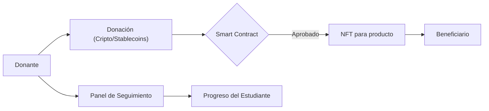

# Funcionalidades clave

La plataforma FutureHands ofrece las siguientes funcionalidades:

* **Perfiles de beneficiario:** Los estudiantes crean perfiles detallados que muestran sus habilidades, experiencia, aspiraciones y necesidades educativas.
* **Sistema de donaciones con criptomonedas/stablecoins:** Facilita las donaciones internacionales y reduce las comisiones, permitiendo a los donantes contribuir con la criptomoneda de su preferencia.
* **Sistema de votación descentralizado:** Los donantes utilizan tokens de gobernanza para votar por los estudiantes que consideran más merecedores de las becas.
* **NFTs para productos:** Representan recursos educativos como computadoras, software y cursos online. Los beneficiarios pueden canjear sus NFTs por los productos correspondientes a través de la plataforma.
* **Panel de seguimiento del donante:** Proporciona información detallada sobre el uso de las donaciones y el progreso de los estudiantes. Permite a los donantes visualizar el impacto directo de sus contribuciones.

