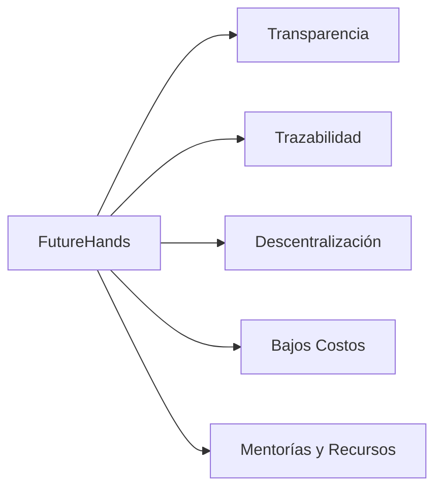

# Ventajas competitivas

FutureHands se distingue de otras plataformas de donación y programas de becas por:

* **Transparencia total:** Cada transacción se registra en la blockchain, permitiendo a los donantes seguir el recorrido de sus fondos y verificar cómo se utilizan.
* **Trazabilidad de principio a fin:** Se puede rastrear el impacto de cada donación, desde el donante hasta el estudiante y el recurso educativo que recibe.
* **Sistema de selección descentralizado:** La comunidad participa en la selección de beneficiarios a través de un sistema de votación transparente y seguro, garantizando la equidad y la meritocracia.
* **Bajos costos de transacción:** El uso de la blockchain Polygon minimiza las tarifas de transacción, maximizando el impacto de cada donación.
* **Acceso a mentorías y recursos adicionales:** Los beneficiarios no solo reciben apoyo financiero, sino también acceso a una red de mentores y recursos educativos complementarios.

