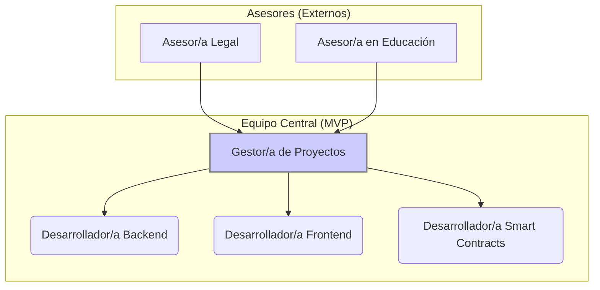

# Equipo y asesores

FutureHands cuenta con un equipo central altamente cualificado y comprometido, con la experiencia necesaria para desarrollar y lanzar el MVP de la plataforma. Posteriormente, el equipo se ampliará a medida que el proyecto crezca.

**Equipo Central (MVP):**

* **Desarrollador/a Backend (Node.js):**
  * **Responsabilidades:** Desarrollo y mantenimiento de la API, gestión de la base de datos, integración con la blockchain, implementación de medidas de seguridad.
  * **Habilidades:** Node.js, Express.js, PostgreSQL, APIs RESTful, Web3.js, control de versiones (Git), metodologías ágiles, seguridad de aplicaciones web.
* **Desarrollador/a Frontend (Flutter):**
  * **Responsabilidades:** Desarrollo y mantenimiento de la interfaz de usuario (web y móvil), integración con la API y la blockchain, optimización del rendimiento, asegurar la usabilidad.
  * **Habilidades:** Flutter, Web3.js, control de versiones (Git), metodologías ágiles, diseño de interfaces de usuario (UI/UX), experiencia de usuario (UX).
* **Desarrollador/a de Smart Contracts (Solidity):**
  * **Responsabilidades:** Diseño, desarrollo, prueba y despliegue de smart contracts. Asegurar la seguridad y la eficiencia del código. Auditar y optimizar los contratos existentes.
  * **Habilidades:** Solidity, Hardhat (o Truffle), patrones de diseño de smart contracts, seguridad de smart contracts, pruebas unitarias, blockchain Polygon.
* **Gestor/a de Proyectos (con experiencia en Blockchain):**
  * **Responsabilidades:** Liderar el desarrollo del proyecto, definir el alcance, gestionar el presupuesto y los plazos, coordinar el equipo, comunicar el progreso a los stakeholders.
  * **Habilidades:** Metodologías ágiles (Scrum, Kanban), herramientas de gestión de proyectos, liderazgo, comunicación, experiencia en proyectos blockchain.

**Equipo Futuro (Post-Lanzamiento):**

* **Especialista en Ciberseguridad:**
  * **Responsabilidades:** Diseñar e implementar la estrategia de ciberseguridad, realizar auditorías de seguridad, analizar vulnerabilidades, responder a incidentes, monitorizar la seguridad de la plataforma.
  * **Habilidades:** Auditorías de seguridad, análisis de vulnerabilidades, respuesta a incidentes, seguridad de aplicaciones web y blockchain, certificaciones en seguridad (ej., CISSP, CEH).
* **Especialista en Marketing y Comunicación:**
  * **Responsabilidades:** Desarrollar e implementar la estrategia de marketing y comunicación, gestionar las redes sociales, crear contenido, organizar eventos, construir la comunidad.
  * **Habilidades:** Marketing digital, redes sociales, content marketing, email marketing, relaciones públicas, crecimiento de comunidades online, experiencia en el sector blockchain.
* **Asesor/a Legal (especializado/a en Blockchain y Criptomonedas):**
  * **Responsabilidades:** Asesorar al equipo en temas legales y regulatorios relacionados con blockchain, criptomonedas y organizaciones sin fines de lucro. Asegurar el cumplimiento normativo.
  * **Habilidades:** Derecho tecnológico, regulación de criptomonedas, KYC/AML, protección de datos, experiencia con organizaciones sin fines de lucro.
* **Asesor/a en Educación:**
  * **Responsabilidades:** Asesorar en el diseño e implementación de programas educativos efectivos para los beneficiarios. Evaluar el impacto de los programas.
  * **Habilidades:** Pedagogía, andragogía, tecnologías educativas, diseño de programas educativos, evaluación de impacto.
