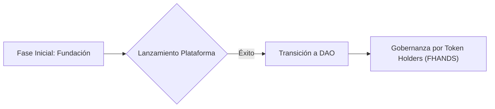

# Gobernanza y descentralización

En su fase inicial, FutureHands es gobernada por la fundación. Sin embargo, nuestro objetivo a largo plazo es la descentralización progresiva de la gobernanza a través de una Organización Autónoma Descentralizada (DAO).

**Transición a una DAO:**

Planeamos la transición a una DAO dentro de los 18 meses posteriores al lanzamiento de la plataforma. Esta DAO será una DAO de token holders, donde los poseedores de FHANDS tendrán derecho a voto en las decisiones importantes de la plataforma.

**Gobernanza con FHANDS:**

Los poseedores de FHANDS podrán:

* **Proponer y votar sobre nuevas funcionalidades de la plataforma.**
* **Decidir la asignación de fondos para becas y proyectos.**
* **Elegir a los miembros del consejo de la DAO.**
* **Aprobar cambios en la estructura de la organización.**

**Proceso de Toma de Decisiones:**

La DAO utilizará un sistema de votación ponderada, donde el peso del voto de cada miembro dependerá de la cantidad de tokens FHANDS que posea. Se establecerán quórums mínimos para la aprobación de propuestas. Todas las propuestas y votaciones se realizarán en la blockchain, garantizando la transparencia y la auditabilidad del proceso.

**Seguridad y Transparencia:**

La seguridad y la transparencia de la DAO son prioritarias. Los smart contracts de la DAO serán auditados por empresas de seguridad externas. Se implementarán medidas para prevenir ataques Sybil y otras formas de manipulación.
