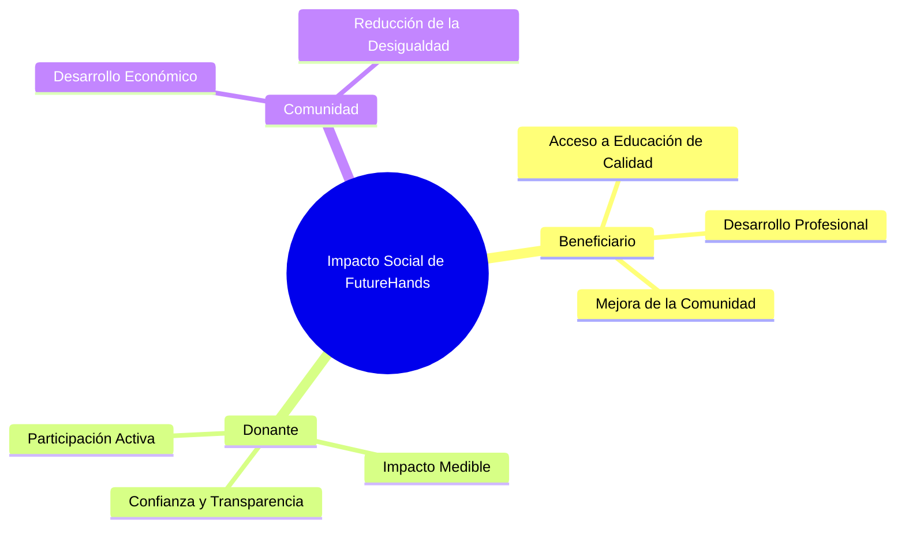

# Impacto Social

FutureHands se compromete a generar un impacto social positivo y duradero a través de la educación. Creemos que la educación es la clave para romper el ciclo de la pobreza y empoderar a las personas para que alcancen su máximo potencial. Nuestra plataforma, basada en la tecnología blockchain, maximiza el impacto de las donaciones al:

* **Aumentar el acceso a la educación de calidad:** FutureHands proporciona a estudiantes de alto potencial los recursos que necesitan para acceder a oportunidades educativas que de otro modo estarían fuera de su alcance. Esto incluye becas, financiamiento para materiales educativos, y acceso a programas de mentoría.
* **Promover el desarrollo profesional:** Al invertir en la educación de los jóvenes, FutureHands contribuye al desarrollo de una fuerza laboral capacitada y preparada para los desafíos del futuro. Esto beneficia no solo a los estudiantes individualmente, sino también a sus comunidades y a la economía global.
* **Fortalecer a las comunidades:** FutureHands se enfoca en apoyar a estudiantes de comunidades desfavorecidas, contribuyendo a la reducción de la desigualdad y al desarrollo económico local. Al empoderar a los jóvenes a través de la educación, FutureHands ayuda a construir comunidades más fuertes y resilientes.
* **Inspirar la filantropía transparente:** FutureHands promueve la transparencia y la rendición de cuentas en el sector de la filantropía. Al mostrar el impacto directo de las donaciones, inspiramos a más personas a involucrarse y a contribuir a la causa de la educación.
* **Crear un ecosistema educativo más equitativo:** FutureHands busca crear un ecosistema educativo más justo y accesible para todos, independientemente de su origen socioeconómico. Creemos que todos los estudiantes merecen la oportunidad de alcanzar su máximo potencial, y trabajamos para hacer de esa visión una realidad.
