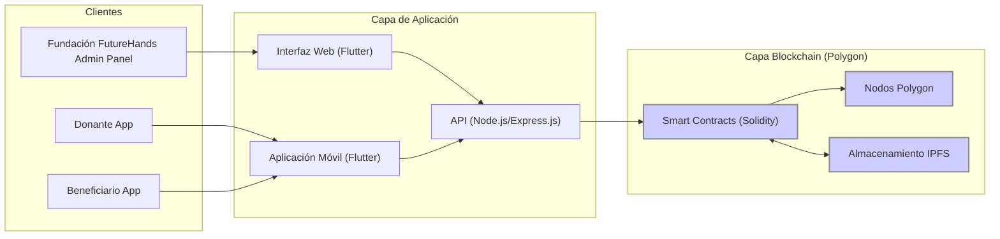

# Arquitectura del Sistema

La plataforma FutureHands se compone de los siguientes elementos clave:

* **Frontend (Flutter):** Interfaces web y móvil intuitivas para donantes y beneficiarios.
* **Backend (Node.js, Express.js):** Gestiona la lógica de la aplicación y la comunicación con la blockchain.
* **API (RESTful):** Permite la interacción entre el frontend y el backend.
* **Smart Contracts (Solidity, Hardhat):** Automatizan la gestión de donaciones, la distribución de fondos y la lógica de la plataforma.
* **Blockchain (Polygon):** Registra las transacciones de forma segura, transparente e inmutable.
* **Almacenamiento (IPFS, PostgreSQL):** Almacena información de manera descentralizada (IPFS) y datos no transaccionales (PostgreSQL).
* **Servicios de Terceros:** Integración con servicios de KYC/AML y oráculos (Chainlink).

