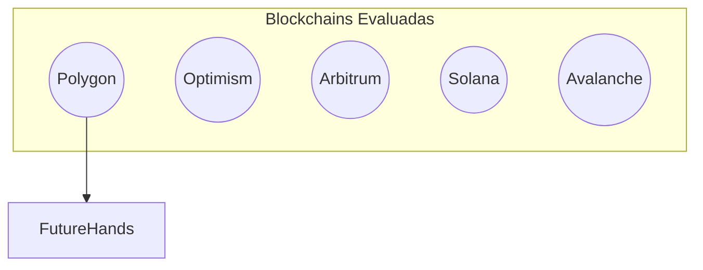

# Justificación Tecnológica

FutureHands se basa en la blockchain Polygon, una solución de capa 2 de Ethereum, para ofrecer una experiencia óptima tanto a donantes como a beneficiarios. Polygon se seleccionó después de una cuidadosa evaluación de diversas tecnologías blockchain, considerando factores clave como escalabilidad, velocidad, costos y seguridad.

* **Escalabilidad:** Polygon procesa un alto volumen de transacciones sin las limitaciones de redes como Ethereum, garantizando un funcionamiento fluido incluso con un crecimiento significativo de usuarios.
* **Velocidad:** Las transacciones en Polygon se confirman rápidamente, lo que permite una gestión ágil de las donaciones.
* **Bajos costos:** Las tarifas de transacción en Polygon son mínimas, maximizando la cantidad de fondos que llegan a los beneficiarios.
* **Seguridad:** Polygon hereda la seguridad robusta de Ethereum, protegiendo las donaciones contra fraudes y ataques.
* **Interoperabilidad:** La compatibilidad con Ethereum facilita la integración con otras soluciones del ecosistema, como plataformas DeFi y billeteras digitales.
* **Comunidad Activa:** Polygon cuenta con una vibrante comunidad de desarrolladores y usuarios, lo que asegura un soporte continuo y un desarrollo constante de la plataforma.
* **Sostenibilidad:** El mecanismo de consenso Proof-of-Stake de Polygon es más eficiente energéticamente que Proof-of-Work, minimizando el impacto ambiental.

Se evaluaron otras soluciones como Optimism, Arbitrum, Solana y Avalanche, pero Polygon demostró ser la opción más adecuada para las necesidades de FutureHands, combinando un rendimiento superior con un ecosistema maduro y una fuerte comunidad. La compatibilidad con Ethereum es crucial para FutureHands, ya que permite la integración con un amplio abanico de herramientas y servicios, simplificando el desarrollo y ampliando las posibilidades de la plataforma.

