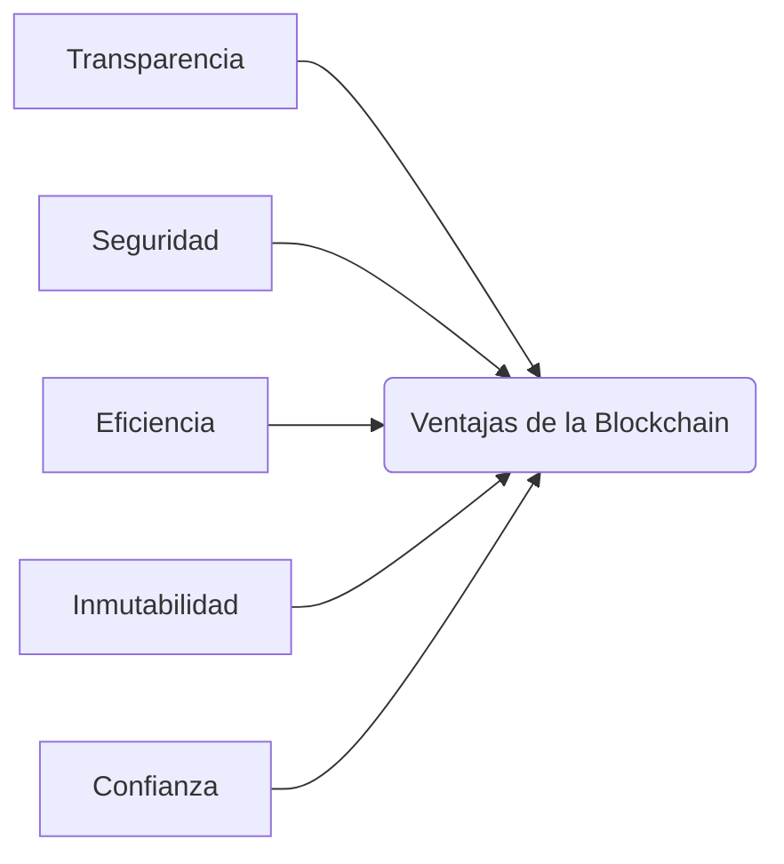

# Ventajas de la Blockchain

La tecnología blockchain proporciona a FutureHands ventajas significativas:

* **Transparencia:** Todas las transacciones son registradas en la blockchain pública de Polygon, permitiendo la auditoría y el seguimiento de las donaciones.
* **Seguridad:** La criptografía y la descentralización de la blockchain protegen los fondos contra fraudes y ataques.
* **Eficiencia:** La automatización mediante smart contracts reduce costos operativos y agiliza la distribución de fondos.
* **Inmutabilidad:** Los registros en la blockchain son permanentes e inalterables, garantizando la integridad de la información.
* **Confianza:** La transparencia y la seguridad de la blockchain fomentan la confianza de los donantes.

